<div align="center">
<h1>Yakitate</h1>

</img>

[](https://github.com/hollow-leaf/yakitate/actions/workflows/ghpage.yml)

</div>

### Demo Page

- WebPage: [https://yakitate.pages.dev/](https://yakitate.pages.dev/)
- Video: [https://youtu.be/KO6caCFEfK4?si=kjPYf8c6wgFMqF-6](https://youtu.be/KO6caCFEfK4?si=kjPYf8c6wgFMqF-6)
- Yakitate Contract(Testnet): [LX6KNW6ECLJ3S7LA7Q5GNIZD72JXJHQOAHNN7SSAR73GZ6N5KEIOLGED3Y](https://app.dappflow.org/explorer/account/LX6KNW6ECLJ3S7LA7Q5GNIZD72JXJHQOAHNN7SSAR73GZ6N5KEIOLGED3Y/transactions)

### Abstract

Yakitate,the decentralized food bank, using Algorand blockchain and smart contracts, connects food suppliers and users transparently. It ensures authentic tracking of production and fair resource allocation. The user-friendly app streamlines food donations and access. This project enhances efficiency, breaks donation food distribution bottlenecks, and fosters community collaboration for a more equitable and sustainable food system.

### Introduction

The goal of our project is to realize a decentralized food bank platform provider. We use Algorand to store and retrieve the acquired food donations metadata, and provide food to receiver, who can obtain food and track food source.

Our solution has the following features and advantages:

- Provide a food platform to facilitate food distribution and inquiry
- Tracking food sources
- Implement a food map so that receivers can get donated food nearby
- Receivers can freely choose the type of food they want

### Method

- Use [Algorand](https://www.algorand.foundation/) to store food donations metadata
- Use [Perawallet](https://docs.perawallet.app/) to build web connect wallet that interacts with algorand blockchain
- Use [Teal](https://developer.algorand.org/docs/get-details/dapps/avm/teal/) to create algorand smart contract
- Use Next.js to build web frontend

### Technical Architecture
Yakitate Architecture


Yakitate workflow

```mermaid
	sequenceDiagram
		participant Food Provider
		participant Food Bank
		participant Receiver
		participant Algorand Contract

		Food Provider ->> Algorand Contract: Register provider in algorand blockchain
		Algorand Contract -->> Food Provider: Return  provider address
		Food Bank ->> Algorand Contract: Register provider in algorand blockchain
		Algorand Contract -->> Food Bank: Return  provider address
		Food Provider ->> Food Bank: Transfer food to Food Bank
		Food Bank ->>　Food Bank: Receive food
		Food Provider ->>Algorand Contract: Provide food
		Algorand Contract -->> Food Provider: return food list and available food
		Food Bank ->>Algorand Contract: Provide food
		Algorand Contract -->> Food Bank: return food list and available food
		
		Receiver ->> Algorand Contract: Search food map, choose food provider or bank and verify food
		alt Receiver request food from "Food Provider"
			Algorand Contract -->> Algorand Contract: Transfer food to Receiver and set freezer for Receiver.
		else Receiver request food from "Food Bank"
		Algorand Contract -->> Algorand Contract: Transfer food to Receiver and set freezer for Receiver.
		end
		opt Finally 
		Algorand Contract -->> Receiver: Receive food and food source data
		end
```


### Building & Installation

> Yakitate is a monorepo managed using turbo. You can find the source code for each package in the apps/web3 and apps/algorand directory.

- apps/web3 is the web frontend for Yakitate. It is built using [Next.js](https://nextjs.org/).
- apps/algorand is the algorand smart contract for Yakitate.It is built using [Teal](https://developer.algorand.org/docs/get-details/dapps/avm/teal/) and Python.

## Setting project
```
git clone https://github.com/hollow-leaf/yakitate.git
```
```
cd yakitate
```
```
nvm use 18
```
```
npm install -g pnpm
```
```
pnpm install && pnpm build && pnpm dev
```

### Contributors

- Frontend + Algorand Contract: [SoloLin](https://github.com/LinXJ1204)
- CI/CD + Frontend: [JakeKuo](https://github.com/crypto0627)